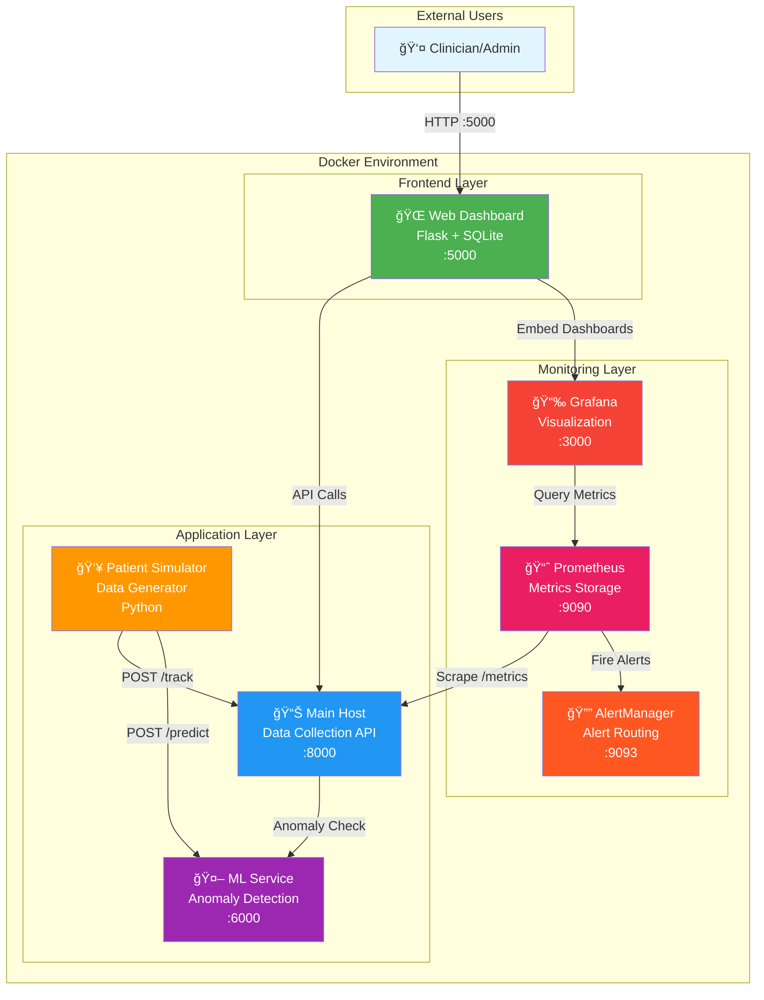

# Healthcare IoT Monitoring System

A real-time patient monitoring system built with Docker, Prometheus, Grafana, and machine learning for anomaly detection in healthcare environments.

## 📋 What This Does

This system monitors patient vital signs (heart rate, SpO2, blood pressure, temperature, etc.) and provides:

- Real-time visualization through Grafana dashboards
- Automated alerting for abnormal vital signs
- Machine learning-based anomaly detection
- Web dashboard for patient management
- Ready for hardware sensor integration (Arduino, ESP32, Raspberry Pi)

## 🏗️ Architecture

The system consists of microservices running in Docker containers:

- **Main Host**: Collects patient data and exposes metrics to Prometheus
- **Web Dashboard**: Flask-based UI for patient management (SQLite database)
- **ML Service**: Analyzes vitals and detects anomalies using machine learning
- **Patient Simulator**: Generates realistic patient data for testing
- **Prometheus**: Scrapes and stores metrics
- **Grafana**: Visualizes data in real-time dashboards
- **AlertManager**: Sends alerts when vital signs exceed thresholds

### System Architecture Diagram



### Architecture Images

For additional visual reference, see the following architecture diagrams:

- **System Architecture**: 
- **Deployment View**: 
- **Component Overview**: 
- **System Design**: 

For detailed deployment architecture and PlantUML diagrams, refer to [DEPLOYMENT_DIAGRAM_GUIDE.md](docs/DEPLOYMENT_DIAGRAM_GUIDE.md).

### Data Flow Diagram


## 🚀 How to Run

### Prerequisites

- Docker Desktop installed and running
- Git (to clone the repository)

### Quick Start

1. **Clone and navigate to the project**

   ```bash
   git clone https://github.com/KMohnishM/CN_Project.git
   cd CN_Project
   ```
2. **Start the system**

   ```bash
   docker-compose up --build
   ```

   Wait 2-3 minutes for all services to start.
3. **Access the dashboards**

   - **Web Dashboard**: http://localhost:5000 (login: admin/admin)
   - **Grafana**: http://localhost:3001 (login: admin/admin)
   - **Prometheus**: http://localhost:9090
   - **AlertManager**: http://localhost:9093
4. **Stop the system**

   ```bash
   docker-compose down
   ```

That's it! The system will start generating simulated patient data automatically.

## 🖥️ Web UI Navigation Flow

The web dashboard provides an intuitive interface for monitoring and managing patient data:


### Key Features by Page:

- **Dashboard** (`/`): Real-time patient status overview, recent alerts, system health
- **Monitoring** (`/monitoring`): Live Grafana charts embedded showing vital signs trends
- **Patients** (`/patients`): 
  - List all patients with search/filter
  - Add new patients with medical information
  - View individual patient details and vital history
  - Edit patient information
- **Analytics** (`/analytics`): Statistical analysis, anomaly detection reports
- **User Profile** (`/profile`): Account management, password change, role information
- **Admin Features**: Threshold configuration, user management (admin role only)

## 📁 Project Structure

```
├── services/           # Application microservices
│   ├── main_host/     # Data collection API
│   ├── web_dashboard/ # Patient management UI
│   ├── ml_service/    # Anomaly detection
│   └── patient_simulator/
├── config/            # Configuration files
│   ├── prometheus/    # Metrics & alerting rules
│   ├── grafana/       # Dashboards & datasources
│   └── alertmanager/  # Alert routing
└── docker-compose.yml # Container orchestration
```
